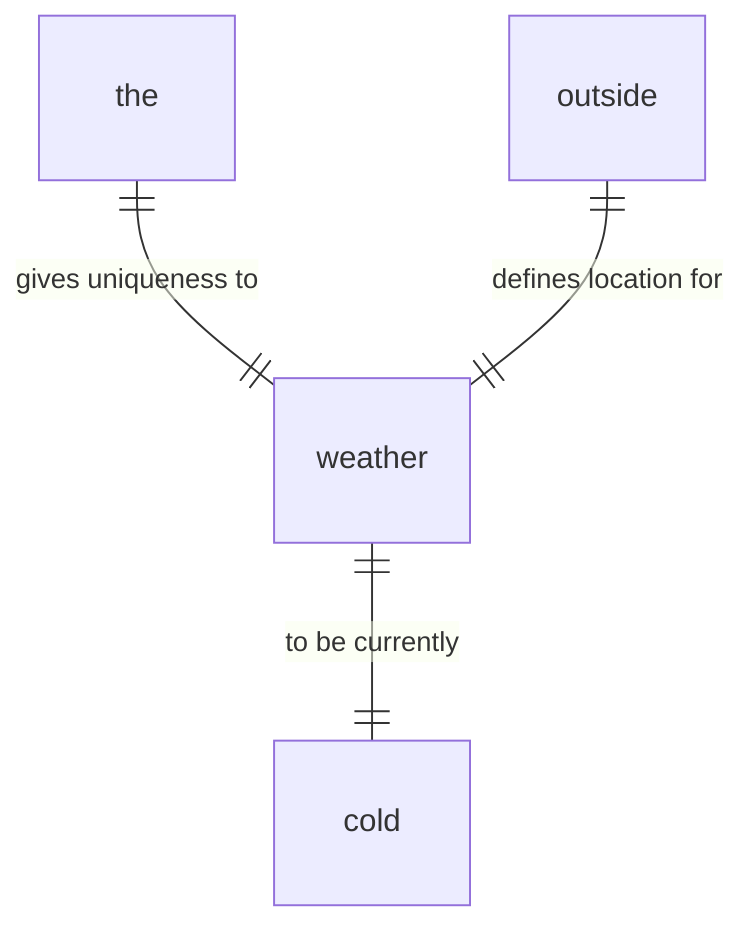
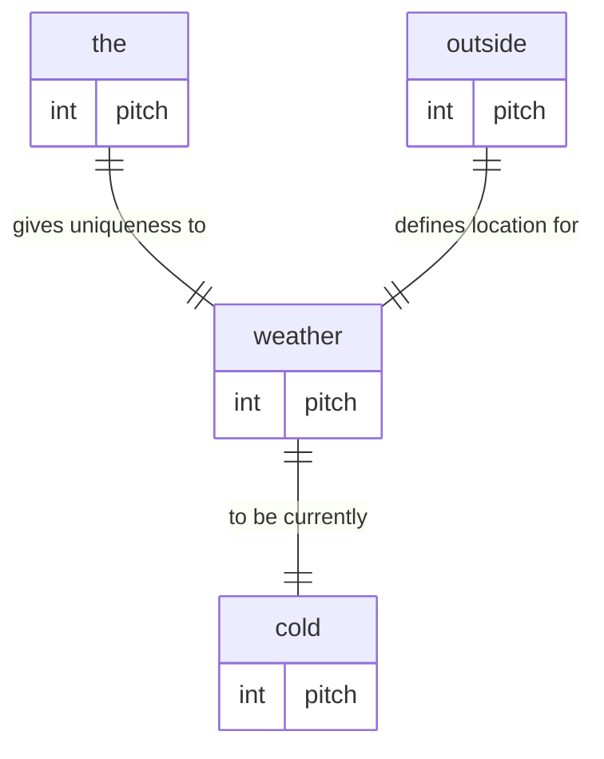

# Idea AST

Simplifying ideas into a human and robot language-agnostic Abstract Syntax Tree.

## The Problem

James/Fido is based on a KRR Graph which is a fancy way of saying: a cloud of things connected by states of being. Which is abstract as fuck, but, it's basically all the knowledge that James/Fido has access to at any given moment. To get data in, we need to decompose ideas into something programmatically serializable.

For english, it's quite simple to break down a sentence such as:

```txt
The weather outside is cold.
```

Which is comprised of the following words (to lower case, removal of all characters that do not match `[a-z]`, split by spaces):

```json
[
  "the",
  "weather",
  "outside",
  "is",
  "cold"
]
```

Which is broken down further into[^1]:

```json
"the": "Used before singular or plural nouns and noun phrases that denote particular, specified persons or things.",
"weather": "The state of the atmosphere at a given time and place, with respect to variables such as temperature, moisture, wind velocity, and barometric pressure."
"outside": "Of, relating to, or being on or near the outer side; outer."
"is": "The third person singular of the substantive verb be, in the indicative mood, present tense."
"cold": "Having a low temperature."
```

Which could be defined in a relationship as:



Now, people can do this just fine, but the computer has no idea how to do this, so we need to create relationships like what we just saw from text and speech. Now, the problem with speech in this context is that we don't have a good way to represent tone in text which is a separate problem in of itself. Later, this'll be included in the graph as such:



[^1]: [The American Heritage® Dictionary of the English Language, 5th Edition and The GNU version of the Collaborative International Dictionary of English](https://www.wordnik.com)
